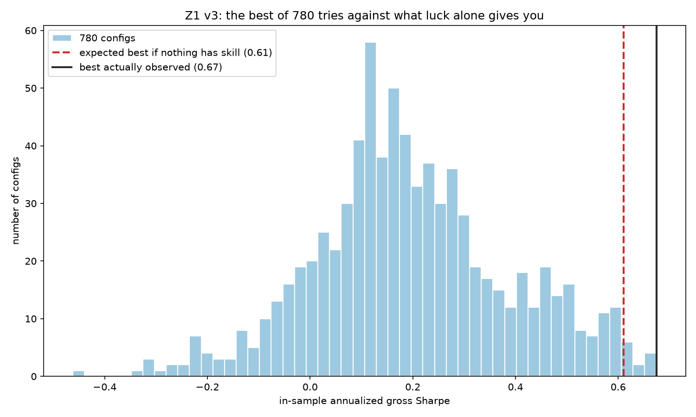

# v3 -- False Discovery Control

Pre-registration commit: `01e84db` (zoo/grid.py, 780 configs, committed before any run)

## Headline finding

Of 780 configurations tried, the best observed in sample gross Sharpe was 0.67 
(config 445: cross_sectional_momentum, 252d lookback, semiannual holding, all_44 universe, vol_targeted sizing)

- Deflated Sharpe Ratio (DSR): 0.639
- HLZ survivors at alpha=0.05: raw 213, Bonferroni 0, Holm 0, BHY 0 (out of 780)
- Reality Check p-value: 0.190

## The best of 780 against pure luck

The clearest way to see the result, the DSR null benchmark says that if NO config in the grid had any skill at all, the best of 780 tries would still be expected to come out at **0.61** annualized.
I observed **0.67**. The whole apparent edge of the winning config is a gap of **0.06** Sharpe over what 780 "coinflips" give you for free.

Figure generated by `stats/plot_v3.py` from `results/zoo_raw_stats.parquet`.

## Survivor list

Empty, 0 of 780 configs survive Bonferroni, Holm or BHY, so there is nothing to hand to v4.
That is the list, and it being empty is the finding.

## Conclusion

Of 780 pre-registered configurations, the best in-sample gross Sharpe observed was 0.67
but this figure is exactly the kind of number multiple-testing bias produces by construction when hundreds of strategies are tried.
Once that trial count and the strategy's non-normal return distribution are accounted for, the Deflated Sharpe Ratio falls to a  0.639 against the inflated null benchmark

The Harvey-Liu-Zhu haircut result is clear: while 213 of 780 trials clear an uncorrected 5% significance test, zero survive Bonferroni, Holm, or Benjamini-Hochberg-Yekutieli correction 

The entire naive "213 significant strategies" result is multiple-testing mistake. 
White's Reality Check, run via stationary bootstrap to respect both the autocorrelation in daily returns and the cross-trial correlation induced by overlapping lookbacks and universes, agrees: 
p = 0.190, nowhere near sufficient to reject the null hypothesis that "the best-of-780 result is chance". 

The honest answer is that nothing in this 780-config world survives correction for how many strategies were tried. 
That is itself the result the project set out to test for, and it is the correct, sad outcome of doing the statistics properly rather than reporting the single best backtest as if it was the only one run.